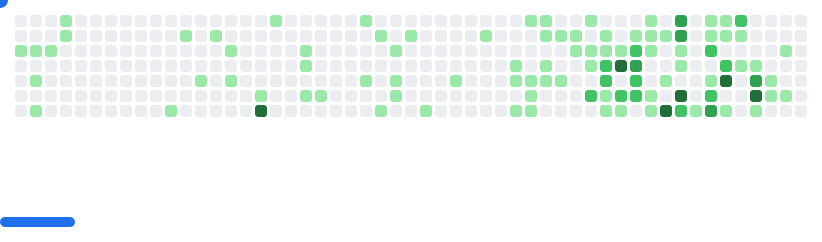

## Yo! 👋

I’m [Surya Atmuri](https://www.linkedin.com/in/surya-atmuri/), a student founder at Georgia Tech, who believes watching your own work “grow up” is one of the most rewarding experiences.  

I'm aiming to be a better engineer and recognize the difference between *good code* and *code that works*. 
So I am seeking industry experience and mentorship alongside my startup journey.

Right now, I’m building in two worlds:  
- **Startups** – Creating products to fix problems I’ve faced, and scaling them to reach others who can benefit.  
- **Recruitment** – Sharing my network and resources to help others find better opportunities.  

Welcome.

---

### Hobbies:
- Reading - favorite books are Tuesdays with Morrie, the Legend series by Marie Lu, and Eckhart Tolle's Power of Now
- Regular activity - weightlifting, basketball, pickup sports
- Watching anime, youtube, and cloud gazing
- Rage-baiting my dog *Snowy* 🐶 

---

### Let’s Connect:
email: surya [at] theuntab [dot] com

<picture>
  <source media="(prefers-color-scheme: dark)" srcset="images/breakout-dark.svg" />
  <source media="(prefers-color-scheme: light)" srcset="images/breakout-light.svg" />
  
</picture>
